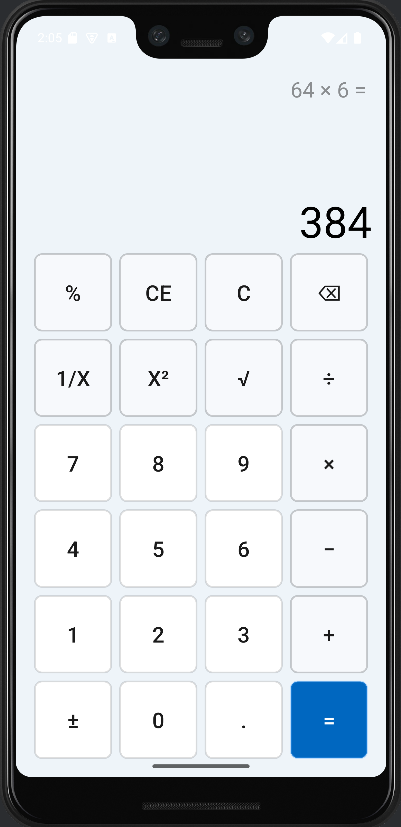

# Bài tập môn Lập trình Di Động - Ứng dụng máy tính bỏ túi đơn giản trên Android

## Thông tin sinh viên:

- Họ và tên: Nguyễn Hữu Lộc
- MSSV: 22110179
- Khoa: Công nghệ thông tin
- Chuyên ngành: Công nghệ phần mềm
- Lớp: 22110CLST2A

## Yêu cầu bài toán:

- Xây dựng ứng dụng máy tính bỏ túi đơn giản trên Android

## Ý tưởng:

Dựa trên phần mềm Calculator sẵn có trên Windows 11, em đã xây dựng ứng dụng máy tính bỏ túi đơn
giản
trên Android với các chức năng cơ bản như: cộng, trừ, nhân, chia, bình phương, căn bậc 2, phần trăm,
nghịch đảo, nghịch đảo dấu,...

## Kết quả thực hiện:

    

